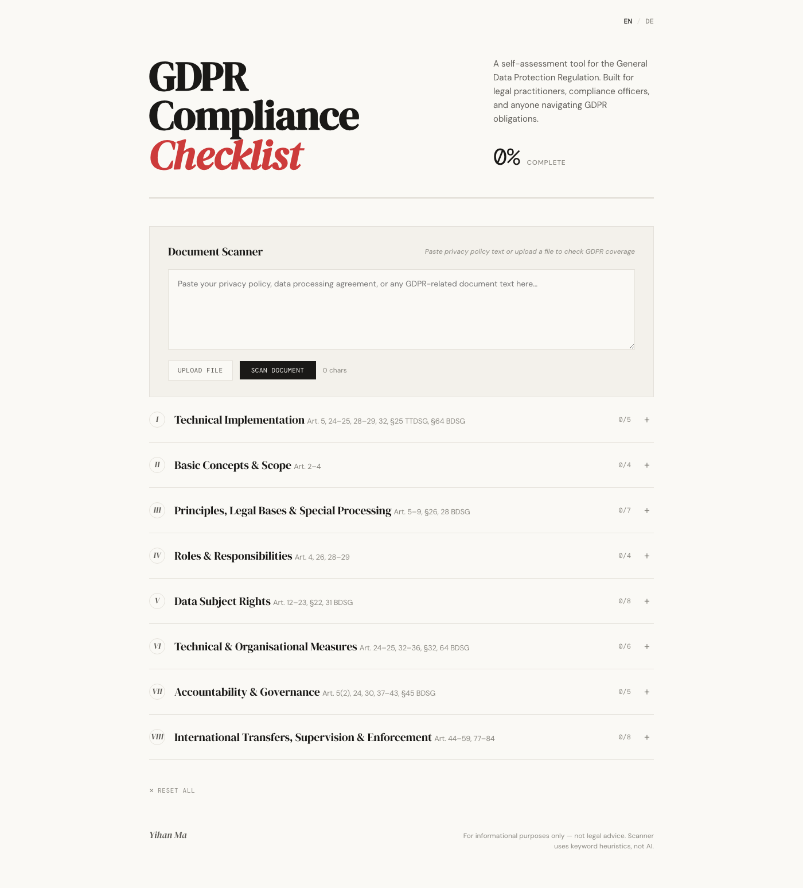
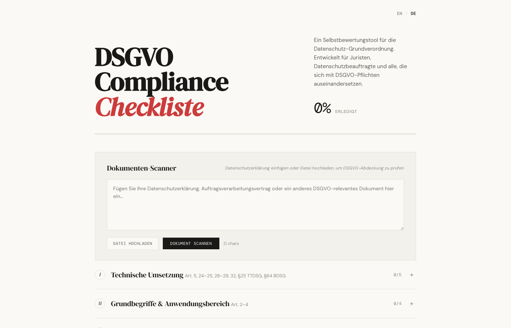
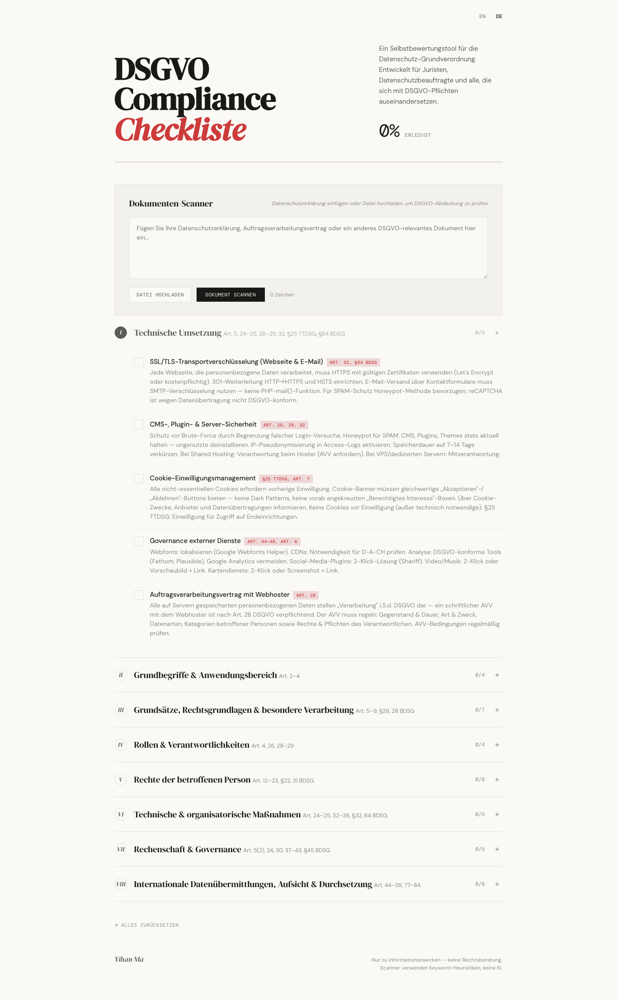
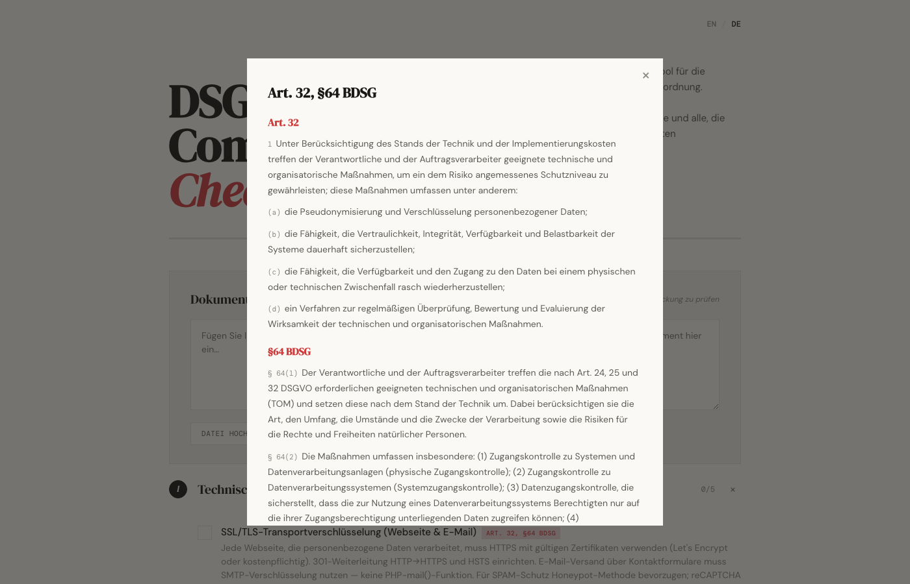
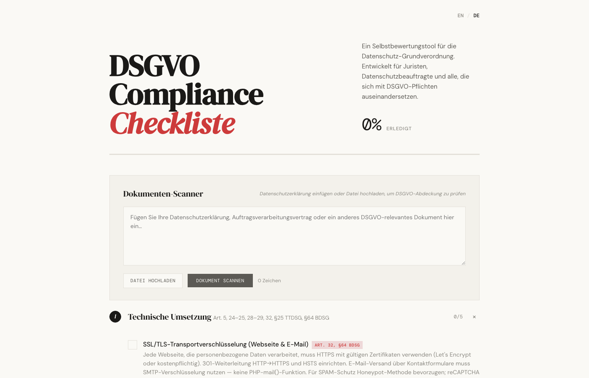
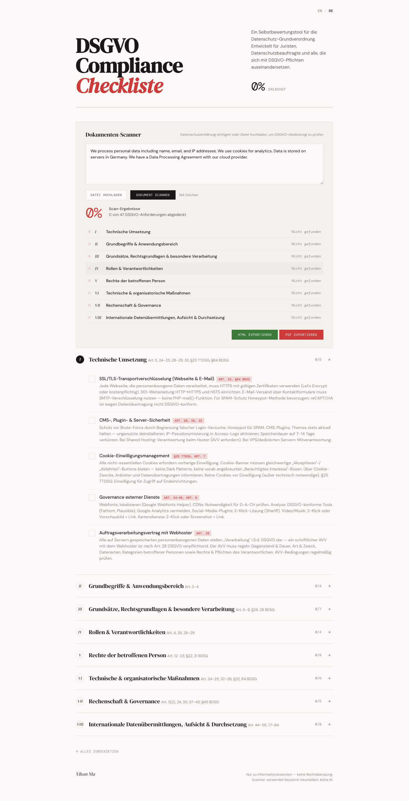

# GDPR Compliance Checklist

Ein interaktives, zweisprachiges Web-Tool zur DSGVO-Compliance-Selbstbewertung. Entwickelt für Datenschutzbeauftragte, Juristen und Compliance-Verantwortliche.

[](https://github.com/malala2409/GDPR-checklist)
[](https://opensource.org/licenses/MIT)
[](https://pages.github.com)

**Live-Demo:** [Hier öffnen](https://malala2409.github.io/GDPR-checklist/gdpr-checklist.html)

---

## ✨ Funktionen

### 📋 Interaktive Checkliste
- **8 Themenbereiche** mit über 47 DSGVO-Prüfpunkten:
  - `I` Technische Umsetzung (Art. 5, 24–25, 28–29, 32, §25 TTDSG, §64 BDSG)
  - `II` Grundbegriffe & Anwendungsbereich (Art. 2–4)
  - `III` Grundsätze, Rechtsgrundlagen & besondere Verarbeitung (Art. 5–9, §26, 28 BDSG)
  - `IV` Rollen & Verantwortlichkeiten (Art. 4, 26, 28–29)
  - `V` Rechte der betroffenen Person (Art. 12–23, §22, 31 BDSG)
  - `VI` Technische & organisatorische Maßnahmen (Art. 24–25, 32–36, §32, 64 BDSG)
  - `VII` Rechenschaft & Governance (Art. 5(2), 24, 30, 37–43, §45 BDSG)
  - `VIII` Internationale Datenübermittlungen, Aufsicht & Durchsetzung (Art. 44–59, 77–84)
- Ein-Klick-Erledigung mit visuellem Fortschrittsbalken
- Persistenz via `localStorage` — Stand bleibt beim Neuladen erhalten

### 🔍 Dokumenten-Scanner
- **Keyword-basierte Analyse** mit über 30 Regex-Patterns (DE + EN)
- **KI-gestützte Analyse** via Anthropic Claude API — semantische Prüfung mit Zitaten und Begründungen
- Unterstützt **PDF** (via PDF.js), **DOCX** (via Mammoth.js), TXT, JSON, CSV, HTML & mehr
- Automatisches Abhaken erkannter Anforderungen
- Visuelle Zusammenfassung pro Abschnitt mit Status-Ampel (`Adressiert` / `Teilweise` / `Nicht gefunden`)
- Klickbare Abschnittszeilen — springt direkt zum entsprechenden Checklistenbereich

### 📄 Gesetzestexte auf Knopfdruck
- Jeder Prüfpunkt enthält eine **Artikel-Referenz** (z. B. `Art. 32, §64 BDSG`)
- Klick öffnet ein Modal mit dem **vollständigen Gesetzestext** (DE + EN)
- Über 50 Artikel und Paragraphen hinterlegt (DSGVO, BDSG, TTDSG)
- Bereichsreferenzen werden automatisch aufgelöst (z. B. `Art. 44–49`)

### 📊 Export-Funktionen
- **HTML-Report** — vollständiger Scan-Bericht mit:
  - Zweispaltigem Layout (Originaltext mit Markierungen + zugeordnete Vorschriften)
  - Interaktiven Beweis-Zitaten
  - Zusammenfassung pro Abschnitt
- **PDF-Export** — druckoptimierte Version via `window.print()`

### 🌐 Internationalisierung
- Vollständig zweisprachig: **Deutsch / Englisch**
- Sprachumschaltung speichert Präferenz im `localStorage`
- Alle UI-Texte, Checklistenpunkte, Scan-Patterns und Gesetzestexte bilingual

---

## 🛠 Technologie

| Bereich | Technologie |
|---------|------------|
| Frontend | HTML5, CSS3 (Custom Properties, Grid, Flexbox) |
| Logik | Vanilla JavaScript (ES6+), Module-Pattern |
| Design | DM Sans / DM Serif Display / DM Mono, handgefertigtes CSS |
| PDF-Parsing | PDF.js (Mozilla) |
| DOCX-Parsing | Mammoth.js |
| KI-Integration | Anthropic Claude API (Sonnet 4.6) |
| Persistenz | `localStorage` (Checkliste, Sprache, API-Key) |

**Keine Frameworks, keine Build-Tools, keine Abhängigkeiten** — eine einzige HTML-Datei, direkt im Browser lauffähig.

---

## 🚀 Quick Start

```bash
# 1. Repository klonen
git clone https://github.com/malala2409/GDPR-checklist.git

# 2. gdpr-checklist.html im Browser öffnen
open gdpr-checklist.html
```

Oder direkt über **GitHub Pages** aufrufen:
```
https://malala2409.github.io/GDPR-checklist/gdpr-checklist.html
```

### KI-Scan aktivieren (optional)

Der Dokumenten-Scanner funktioniert auch ohne KI. Für die KI-gestützte Analyse:

```bash
# Claude API Proxy lokal starten
python3 server.py
```

Dann im Browser einen Anthropic API-Key im `localStorage` hinterlegen (Eingabefeld erscheint bei erster KI-Nutzung).

---

## 📂 Projektstruktur

```
GDPR-checklist/
├── gdpr-checklist.html    # Hauptanwendung (HTML + CSS)
├── js/
│   ├── main.js            # Globaler State, Init, Persistenz
│   ├── data.js            # I18N, Checklistendaten, Scan-Patterns (30+)
│   ├── articles.js        # DSGVO/BDSG/TTDSG-Gesetzestexte (50+ Artikel)
│   ├── checklist.js       # Checklisten-Rendering, Fortschritt, Modals
│   └── scanner.js         # Dokumenten-Scanner, KI-Integration, Export
├── server.py              # Claude API Proxy (optional)
└── README.md
```

---

## 📸 Screenshots

### 📋 Interaktive Checkliste

<div align="center">
  
  
  <p><em>8 Themenbereiche mit 47+ Prüfpunkten — vollständig zweisprachig DE/EN</em></p>
</div>

### ✅ Fortschritt & Abschnitte

<div align="center">
  
  
  <p><em>Links: Ein-Klick-Erledigung mit Fortschrittsbalken · Rechts: Akkordeon-Abschnitte mit Artikel-Referenzen</em></p>
</div>

### 📜 Gesetzestexte auf Knopfdruck

<div align="center">
  
  <p><em>Klick auf eine Artikel-Referenz öffnet den vollständigen Gesetzestext (DE/EN) — 50+ Artikel hinterlegt</em></p>
</div>

### 🔍 Dokumenten-Scanner

<div align="center">
  
  <p><em>Text-Input + Datei-Upload (PDF, DOCX, TXT) mit Keyword- und KI-gestützter Analyse</em></p>
</div>

### 📊 Scan-Ergebnisse

<div align="center">
  
  <p><em>Ergebnis-Übersicht mit Score, Abschnitts-Ampeln und Export-Optionen (HTML/PDF)</em></p>
</div>

---

## 🔑 Hinweise

- **Keine Rechtsberatung** — das Tool dient ausschließlich Informations- und Selbstbewertungszwecken
- Der Keyword-Scanner arbeitet mit heuristischen Regex-Patterns und ersetzt keine juristische Prüfung
- Die KI-Analyse erfordert einen eigenen Anthropic API-Key und einen lokalen Proxy-Server
- Alle Checklistendaten bleiben **ausschließlich lokal** im Browser — keine Server-Übertragung

---

## 📄 Lizenz

MIT License — siehe [LICENSE](LICENSE)

---

<p align="center">
  <sub>Entwickelt von <strong>Yihan Ma</strong> — Vanilla JS, kein Framework, reiner Browser</sub>
</p>
